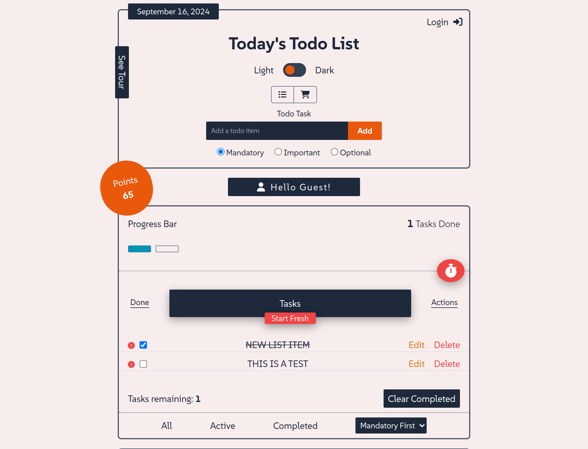
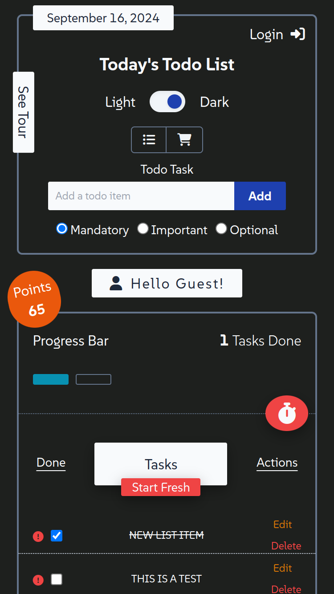

# Full Featured To Do List App

**Live Site:** [TodoListApp](https://dev-jlagunas.github.io/vue-fulltodolist/)

This is a full-featured to-do and shopping list app, built using Vue 3, that offers a sleek and interactive user experience with a variety of advanced features like dark/light mode, Firebase login, priority-based task sorting, and visual progress tracking. The app also includes gamification elements like a point system and celebratory animations for completed tasks, making task management more engaging. It's fully responsive, follows Vue best practices, and delivers great performance with strong Lighthouse scores.

## Features

- **Built with Vue 3**: Modern, dynamic, and reactive components for a seamless user experience.
- **Dark/Light Mode**: Toggle between dark and light themes for a personalized viewing experience.
- **Firebase Login Authentication**: Secure user authentication using Firebase for login functionality.
- **Guided Tour for First-Time Users**: A guided introduction to the app using Vue.js Tour to help new users get started.
- **Switch Between To-Do and Shopping List Modes**: Easily toggle between task modes to manage different types of lists.
- **Add, Edit, Delete, and Mark Tasks as Complete**: Full task management functionality with the ability to modify and organize tasks.
- **Task Prioritization and Sorting**: Assign priorities to tasks and sort by "mandatory first" or "optional first" for better task management.
- **Visual Progress Bar**: A dynamic progress bar that fills as tasks are completed for visual tracking.
- **Delete All Tasks at Once**: Clear all tasks with a single action for easy list management.
- **Point System**: Gamify the experience with a point system—reach 100 points to trigger a celebratory modal animation.
- **Canvas Confetti for Task Completion**: Enjoy a canvas confetti surprise when tasks are completed.
- **Crossed-Out Completed Tasks**: Visually distinguish completed tasks by crossing them out.
- **Task Counters**: Real-time task counters display the number of tasks remaining and completed.
- **Time Challenge Mode**: Challenge yourself to complete a task in a set time for bonus points, or lose points if time runs out.
- **Fully Responsive Design**: Designed to work smoothly on all screen sizes and devices.
- **High Lighthouse Scores**: Optimized for performance, accessibility, best practices, and SEO.
- **State Management with Pinia**: Efficient and scalable state management using Pinia for better code organization.
- **Modular Components and Best Practices**: Built with reusable and modular components, following Vue best practices.

## Screenshots

### Desktop

  
  

## Recommended IDE Setup

[VSCode](https://code.visualstudio.com/) + [Volar](https://marketplace.visualstudio.com/items?itemName=Vue.volar) (and disable Vetur).

## Customize Configuration

See [Vite Configuration Reference](https://vitejs.dev/config/).

## Installation and Setup Instructions

Clone down this repository. You will need `node` and `npm` installed globally on your machine.

- **Install project dependencies:** `npm install`
- **To Start Server:** `npm run dev`
- **To Visit App:** `http://localhost:5173`

## Contributing

While this project is primarily a personal, educational project, input and suggestions are welcome. If you have feedback, please open an issue in this repository.

## License

This project is licensed under the terms of the MIT License. See the [LICENSE](LICENSE) file for details.

## Contact

**Juan Lagunas** - [GitHub](https://github.com/dev-jLagunas)

Email: dev.jlagunas@gmail.com

Feel free to reach out if you have any questions, or if you want to discuss this project.

For more of my work, check out my [GitHub profile](https://github.com/dev-jLagunas) or visit my portfolio profile site for other projects I've done: [MyPortfolio](https://dev-jlagunas.github.io/my-portfolio/#/)

## Acknowledgements

- Thanks to [Vue](https://vuejs.org/)
- Thanks to anyone who takes the time come to checkout my work.
- Thanks to my wife for giving me the opportunity to spend so much time in front of a computer.
